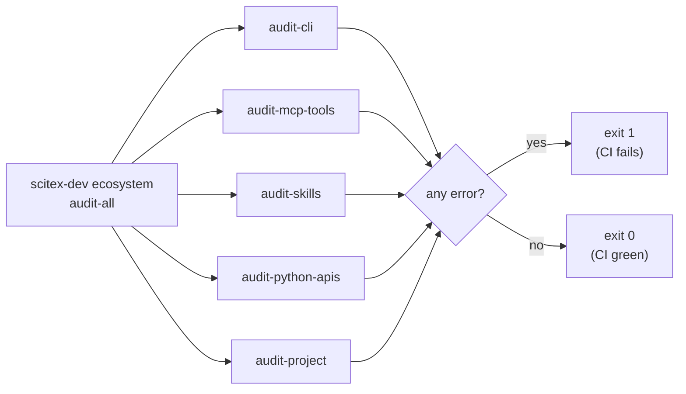

# SciTeX Dev (`scitex-dev`)

<p align="center">
  <a href="https://scitex.ai">
    
  </a>
</p>

<p align="center"><b>Shared developer utilities for the SciTeX ecosystem</b></p>

<p align="center">
  <a href="https://scitex-dev.readthedocs.io/">Full Documentation</a> · <code>uv pip install scitex-dev[all]</code>
</p>

<!-- scitex-badges:start -->
<p align="center">
  <a href="https://pypi.org/project/scitex-dev/"></a>
  <a href="https://pypi.org/project/scitex-dev/"></a>
  <a href="https://github.com/ywatanabe1989/scitex-dev/actions/workflows/rtd-sphinx-build-on-ubuntu-latest.yml"></a>
  <a href="https://www.gnu.org/licenses/agpl-3.0"></a>
</p>
<p align="center">
  <a href="https://github.com/ywatanabe1989/scitex-dev/actions/workflows/pytest-matrix-on-ubuntu-py3-11-3-12-3-13.yml"></a>
  <a href="https://github.com/ywatanabe1989/scitex-dev/actions/workflows/import-smoke-on-ubuntu-py3-12.yml"></a>
  <a href="https://github.com/ywatanabe1989/scitex-dev/actions/workflows/quality-audit-on-ubuntu-latest.yml"></a>
  <a href="https://codecov.io/gh/ywatanabe1989/scitex-dev"></a>
</p>
<!-- scitex-badges:end -->

---

## Problem and Solution

| # | Problem | Solution |
|---|---------|----------|
| 1 | **~70 ecosystem packages drift apart** -- versions, READMEs, sphinx setups, CLI conventions diverge faster than humans can audit | **`scitex-dev ecosystem audit-*`** -- `audit-project`, `audit-cli`, `audit-mcp-tools`, `audit-python-apis`, `audit-skills`, `audit-summary` enforce ~130 numbered rules across the whole ecosystem |
| 2 | **Skills scattered across ~70 source repos** -- AI agents can't discover them; humans can't review them | **`scitex-dev skills list / get / export`** -- aggregate every package's `_skills/` and symlink them into `~/.claude/skills/scitex/` for live-edit dev loops |
| 3 | **Coordinated releases need ten manual steps** -- bump version, push tag, watch CI, verify PyPI, deploy — done per-package, multiplied by 70 | **`scitex-dev ecosystem sync` + `check-versions` + `start-dashboard`** -- one-shot install/sync across hosts, version-mismatch detection, and a web dashboard with the live state |
| 4 | **Bulk renames across 70 repos break cross-references** -- import paths, doc references, symlinks — `sed -i` corrupts something every time | **`scitex-dev rename-symbols`** -- atomic rename with cross-reference updates, regex support, dry-run preview, git-safety guards |
| 5 | **Lint rules drift from the API they enforce** -- a renamed function in figrecipe leaves the rule pointing at a nonexistent symbol, and the bug only shows up months later | **`scitex-dev linter`** (engine, formerly `scitex-linter`) -- aggregates per-package rule plugins via the `scitex_dev.linter.plugins` entry point. Rules ship in the package whose API they enforce, so rename + rule + test land in one PR. Doc-block linting for `.py` / `.ipynb` / `.md` / `.rst`. `scitex-dev linter sweep` walks every package's README + docs in one shot |

## Installation

```bash
pip install scitex-dev

# With CLI support:
pip install scitex-dev[cli]

# With MCP server:
pip install scitex-dev[mcp]

# Everything:
pip install scitex-dev[all]
```

### Configuration

Copy [`.env.example`](.env.example) to `.env` (gitignored) at your
project root, then edit. CLI flags always override env vars. The full
list (with inline comments) lives in `.env.example`.

<details>
<summary><strong>Local state directories</strong></summary>

<br>

scitex-dev reads optional config + cache from the canonical SciTeX
local-state locations:

| Path                          | Scope         | Purpose                              |
|-------------------------------|---------------|--------------------------------------|
| `~/.scitex/dev/`              | user-global   | per-user config, cache               |
| `<proj-root>/.scitex/dev/`    | project-local | overrides for the current repo       |

Project-local wins when both exist. Both are optional.

</details>

## Architecture

```
scitex_dev/
├── _cli/
│   ├── audit/                ← rule corpus (PA*, PS*, SK*, §*)
│   │   ├── _api/             ← Python-API rules (PA-1xx)
│   │   ├── _project/         ← project-structure rules (PS-1xx, PS-5xx)
│   │   ├── _skills/          ← skill-file rules (SK-1xx)
│   │   └── _summary/         ← CLI/MCP §-rules + audit-all wrapper
│   ├── ecosystem/            ← cross-package commands (audit-all, list, …)
│   └── _skills.py            ← `scitex-dev skills` group
├── _ecosystem/               ← shared helpers (skill-quality, ECOSYSTEM map)
├── _skills/                  ← canonical skill-file corpus shipped to agents
└── testing/                  ← `audit_all_for_package` pytest helper
```

Audit rules live alongside the code they check. Each rule has a
docstring, an entry in `RULES`, a severity in `_SEVERITY_OVERRIDES`,
and at least one unit test under `tests/.../_audit/_project/`.

## Demo



`scitex-dev` is a CLI/audit tool — its "demo" is the audit running on a
package. Sample output (run on `scitex-io`):

```
=== audit-cli ===
ok    scitex-io: no CLI convention violations

=== audit-mcp-tools ===
ok  scitex-io: no MCP convention violations

=== audit-skills ===
ok  scitex-io: no skills violations

=== audit-python-apis ===
ok  scitex-io: no Python API violations

=== audit-project ===
ok  scitex-io: no project-structure violations
```

Failure mode (sample, scitex-dsp before the Hilbert fix):

```
=== audit-project ===
fail  scitex-dsp (/home/ywatanabe/proj/scitex-dsp): 2 error(s)
  [E] [PS-141 §1] README.md: missing mandatory `## Demo` section
  [E] [PS-503 §5] examples/01_demo_out: no FINISHED_SUCCESS/<session_id>/ subdir
```

See [`examples/`](examples/) for runnable demos that exercise
`scitex-dev`'s own commands (search, version-management, docs
aggregation).

## Four Interfaces

<details>
<summary><strong>Python API ⭐⭐</strong></summary>

All public names are re-exported flat from the top-level package — import
them directly from `scitex_dev` (internals live under `_release`, `_docs`,
`_core`; don't import those paths).

```python
# Version management
from scitex_dev import detect_mismatches, fix_local, fix_remote, verify_versions
mismatches = detect_mismatches()
fix_local(packages=["scitex-stats"], confirm=True)
verify_versions()

# CI/CD
from scitex_dev import check_ci, get_failing_packages, check_pypi_publish
status = check_ci()
failing = get_failing_packages()

# Docs & search
from scitex_dev import get_docs, build_docs, search
get_docs(package="scitex-writer")
search("save figure")

# Deployment
from scitex_dev import deploy_scitex_hub, verify_production
deploy_scitex_hub(confirm=True)

# LLM-friendly types
from scitex_dev import Result, ErrorCode, supports_return_as
```

> Skills are managed through the CLI (`scitex-dev skills list/get/export`),
> not a Python module.

</details>

<details open>
<summary><strong>CLI Commands ⭐⭐⭐ (primary)</strong></summary>

```bash
# Ecosystem management
scitex-dev ecosystem list
scitex-dev ecosystem list --versions
scitex-dev ecosystem fix-mismatches --dry-run
scitex-dev ecosystem sync

# Documentation
scitex-dev docs --package scitex-writer
scitex-dev search-docs "save figure"

# Bulk rename
scitex-dev rename-symbols old_name new_name --dry-run

# See all commands
scitex-dev --help
scitex-dev --help-recursive
```

</details>

<details>
<summary><strong>MCP Server ⭐⭐</strong></summary>

```bash
# Start server
scitex-dev mcp start

# Check setup
scitex-dev mcp doctor
scitex-dev mcp list-tools

# Installation info
scitex-dev mcp installation
```

**Claude Code Setup** — add `.mcp.json` to your project root. Use `SCITEX_DEV_ENV_SRC` to load configuration from a `.src` file:

```json
{
  "mcpServers": {
    "scitex-dev": {
      "command": "scitex-dev",
      "args": ["mcp", "start"],
      "env": {
        "SCITEX_DEV_ENV_SRC": "${SCITEX_DEV_ENV_SRC}"
      }
    }
  }
}
```

Switch environments via your shell profile:

```bash
# Local machine
export SCITEX_DEV_ENV_SRC=~/.scitex/dev/local.src

# Remote server
export SCITEX_DEV_ENV_SRC=~/.scitex/dev/remote.src
```

</details>

<details open>
<summary><strong>Skills ⭐⭐⭐ (primary)</strong></summary>

<br>

Skills provide workflow-oriented guides that AI agents query to discover capabilities and usage patterns.

```bash
scitex-dev skills list              # List available skill pages
scitex-dev skills get SKILL         # Show main skill page
scitex-dev skills export --package scitex-dev  # Export to Claude Code
# Private skills (~/.scitex/*/skills/*-private/) are symlinked automatically
```

> **[Full skills directory](https://github.com/ywatanabe1989/scitex-dev/tree/develop/src/scitex_dev/_skills)**

| Skill | Content |
|-------|---------|
| `result-types` | `Result`, `ErrorCode`, `@supports_return_as` for LLM-friendly responses |
| `cli-mcp-utils` | CLI and MCP utility helpers |
| `config` | Package configuration and priority config patterns |
| `versions` | Version management, mismatch detection and fixing |
| `ecosystem` | Ecosystem list, sync, and commit workflows |
| `rename` | Safe bulk rename with cross-reference updates |
| `docs-search` | Documentation aggregation and unified search |
| `test-runner` | Local and HPC test execution |
| `full-update` / `full-update-deploy` | End-to-end audit → bump → release → sync pipelines |
| `agentic-test-overview` / `-skills` / `-mcp` | Agent-vs-agent quality testing |
| `dynamic-audit` | Cross-package periodic audit checklist |
| `env-vars` | `SCITEX_DEV_*` / `SCITEX_*` environment variable reference |

</details>

## Part of SciTeX

`scitex-dev` is part of [**SciTeX**](https://scitex.ai). Install via
the umbrella with `pip install scitex[dev]` to use as
`scitex.dev` (Python) or `scitex dev ...` (CLI).

SciTeX follows the Four Freedoms for Research below, inspired by
[the Free Software Definition](https://www.gnu.org/philosophy/free-sw.en.html):

>Four Freedoms for Research
>
>0. The freedom to **run** your research anywhere — your machine, your terms.
>1. The freedom to **study** how every step works — from raw data to final manuscript.
>2. The freedom to **redistribute** your workflows, not just your papers.
>3. The freedom to **modify** any module and share improvements with the community.
>
>AGPL-3.0 — because we believe research infrastructure deserves the same freedoms as the software it runs on.

---

<p align="center">
  <a href="https://scitex.ai">
    
  </a>
</p>
