# SciTeX Ecosystem Dependency Snapshot

This document is a one-time, hand-generated visualization of the inter-package
dependency graph across the SciTeX ecosystem. It captures hard runtime
dependencies and optional/extra dependencies declared in each package's
`pyproject.toml`, restricted to ecosystem-internal edges (`scitex-*`,
`figrecipe`, `crossref-local`, `openalex-local`). It is intended as a
human-readable map for newcomers and a sanity check for architectural drift —
not as a live source of truth.

> **Snapshot as of 2026-04-27.** Regenerate via the level-2 ecosystem tool when it
> lands; do not edit this file by hand for routine updates. Total nodes:
> **64**, total edges: **68**.

## Dependency Graph

```mermaid
graph LR
  subgraph Foundational["Foundational"]
    scitex_dev["scitex-dev"]
  end
  subgraph Middle["Middle"]
    crossref_local["crossref-local"]
    figrecipe["figrecipe"]
    openalex_local["openalex-local"]
    scitex_agent_container["scitex-agent-container"]
    scitex_app["scitex-app"]
    scitex_audio["scitex-audio"]
    scitex_audit["scitex-audit"]
    scitex_benchmark["scitex-benchmark"]
    scitex_bridge["scitex-bridge"]
    scitex_browser["scitex-browser"]
    scitex_capture["scitex-capture"]
    scitex_chat["scitex-chat"]
    scitex_clew["scitex-clew"]
    scitex_cloud["scitex-cloud"]
    scitex_compat["scitex-compat"]
    scitex_config["scitex-config"]
    scitex_container["scitex-container"]
    scitex_context["scitex-context"]
    scitex_core["scitex-core"]
    scitex_cv["scitex-cv"]
    scitex_dataset["scitex-dataset"]
    scitex_datetime["scitex-datetime"]
    scitex_db["scitex-db"]
    scitex_decorators["scitex-decorators"]
    scitex_dict["scitex-dict"]
    scitex_dsp["scitex-dsp"]
    scitex_etc["scitex-etc"]
    scitex_events["scitex-events"]
    scitex_gists["scitex-gists"]
    scitex_git["scitex-git"]
    scitex_hpc["scitex-hpc"]
    scitex_introspect["scitex-introspect"]
    scitex_io["scitex-io"]
    scitex_linalg["scitex-linalg"]
    scitex_linter["scitex-linter"]
    scitex_logging["scitex-logging"]
    scitex_msword["scitex-msword"]
    scitex_nn["scitex-nn"]
    scitex_notebook["scitex-notebook"]
    scitex_notification["scitex-notification"]
    scitex_orochi["scitex-orochi"]
    scitex_os["scitex-os"]
    scitex_parallel["scitex-parallel"]
    scitex_path["scitex-path"]
    scitex_pd["scitex-pd"]
    scitex_plt["scitex-plt"]
    scitex_repro["scitex-repro"]
    scitex_resource["scitex-resource"]
    scitex_security["scitex-security"]
    scitex_sh["scitex-sh"]
    scitex_skills["scitex-skills"]
    scitex_stats["scitex-stats"]
    scitex_str["scitex-str"]
    scitex_template["scitex-template"]
    scitex_tex["scitex-tex"]
    scitex_tunnel["scitex-tunnel"]
    scitex_types["scitex-types"]
    scitex_ui["scitex-ui"]
    scitex_web["scitex-web"]
    scitex_writer["scitex-writer"]
  end
  subgraph Apps["Apps"]
    scitex_gen["scitex-gen"]
    scitex_scholar["scitex-scholar"]
    scitex_session["scitex-session"]
  end
  %% Hard runtime dependencies
  crossref_local --> scitex_dev
  scitex_agent_container --> scitex_container
  scitex_browser --> scitex_logging
  scitex_cloud --> scitex_app
  scitex_cloud --> scitex_writer
  scitex_container --> scitex_dev
  scitex_dataset --> scitex_dev
  scitex_db --> scitex_core
  scitex_dsp --> scitex_decorators
  scitex_dsp --> scitex_gen
  scitex_dsp --> scitex_nn
  scitex_gen --> scitex_context
  scitex_gen --> scitex_decorators
  scitex_gen --> scitex_dict
  scitex_gen --> scitex_introspect
  scitex_gen --> scitex_os
  scitex_gen --> scitex_session
  scitex_gen --> scitex_sh
  scitex_gen --> scitex_stats
  scitex_gen --> scitex_str
  scitex_io --> scitex_dev
  scitex_linter --> scitex_dev
  scitex_nn --> scitex_decorators
  scitex_nn --> scitex_gen
  scitex_notebook --> scitex_clew
  scitex_pd --> scitex_types
  scitex_plt --> figrecipe
  scitex_scholar --> scitex_browser
  scitex_scholar --> scitex_io
  scitex_scholar --> scitex_logging
  scitex_session --> scitex_dict
  scitex_session --> scitex_logging
  scitex_session --> scitex_repro
  scitex_session --> scitex_str
  scitex_str --> scitex_dict
  scitex_writer --> scitex_dev
  scitex_writer --> scitex_ui
  %% Optional/extra dependencies
  figrecipe -.->|app| scitex_app
  figrecipe -.->|app| scitex_ui
  figrecipe -.->|dev| scitex_dev
  figrecipe -.->|scitex| scitex_app
  figrecipe -.->|scitex| scitex_ui
  openalex_local -.->|dev| scitex_dev
  scitex_agent_container -.->|dev| scitex_dev
  scitex_app -.->|dev| scitex_dev
  scitex_audit -.->|dev| scitex_dev
  scitex_browser -.->|dev| scitex_dev
  scitex_clew -.->|dev| scitex_dev
  scitex_cloud -.->|django| scitex_ui
  scitex_core -.->|dev| scitex_dev
  scitex_db -.->|dev| scitex_dev
  scitex_dict -.->|dev| scitex_dev
  scitex_etc -.->|dev| scitex_dev
  scitex_gists -.->|dev| scitex_dev
  scitex_logging -.->|dev| scitex_dev
  scitex_notebook -.->|linter| scitex_linter
  scitex_notification -.->|audio| scitex_audio
  scitex_orochi -.->|agent-container| scitex_agent_container
  scitex_path -.->|dev| scitex_dev
  scitex_repro -.->|dev| scitex_dev
  scitex_resource -.->|sh| scitex_sh
  scitex_scholar -.->|clew| scitex_clew
  scitex_scholar -.->|dev| scitex_dev
  scitex_session -.->|dev| figrecipe
  scitex_stats -.->|dev| scitex_dev
  scitex_stats -.->|figrecipe| figrecipe
  scitex_str -.->|dev| scitex_dev
  scitex_types -.->|dev| scitex_dev
  scitex_ui -.->|cli| scitex_dev
  scitex_ui -.->|dev| scitex_dev
  scitex_writer -.->|scholar| scitex_scholar
```

Solid arrows (`-->`) are hard runtime dependencies; dotted arrows (`-.->`) are
optional/extra dependencies and are labelled with the extra name.

## Fan-in / Fan-out Summary

| Most depended-on (fan-in) | count |   | Widest deps (fan-out) | count |
|---|---|---|---|---|
| `scitex-dev` | 26 |   | `scitex-gen` | 9 |
| `figrecipe` | 3 |   | `scitex-scholar` | 5 |
| `scitex-decorators` | 3 |   | `scitex-session` | 5 |
| `scitex-dict` | 3 |   | `figrecipe` | 3 |
| `scitex-logging` | 3 |   | `scitex-cloud` | 3 |

## Cycles

None detected.

